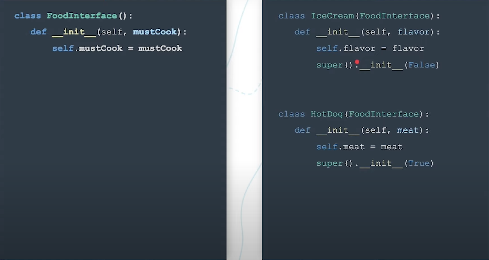

#### Importing code

*The Basic Import Mechanism*

* Python searches for a module with a matching name in its known set of locations (`sys.path`) which resolves the specific module path. You can specify relative imports using dots to represent relative paths to the current file (read more).
* The Python module includes a special file named __init__.py which contains some code to initialize the module (i.e. import module dependencies, bundle submodules). Watch for this in the upcoming exercise, where you'll be creating the `__init__.py` files yourself!
* If the `as` keyword is used (like in `from os import open as open_`), the resolved module is bound to the specified variable name.
* The module can then be used within the script.

#### Pythonic Class Inheritance




#### Abstract Classes

In Python, we can define an *abstract class* by inheriting the Python Standard Library's *Abstract Base Class (ABC)*. This helps us out in two ways:

* It prevents an abstract class from being instantiated.
* It indicates that any abstract methods should be defined in the children classes.

To do this, we would first import ABC, and then we can have our Animal class inherit from it:

```python
from abc import ABC

class Animal(ABC):
    pass
```

#### Override

As you practice inheritance and build more complex systems of classes, you'll find the need to redefine methods and functionality. This redefinition is known as overriding methods. Ultimately, it is as simple as re-writing a method body. You may need to override a method when:

* You are realizing an abstract class
* You are extending a class and the method definition is now dependent on new information in the child class
* You want to ensure an object fully realizes the base object's interface (i.e. init, repr, str)

Keep in mind, you can always access the parent method's implementation of a specific method using the `super()` method. This will allow you to extend a method without repeating code. For example:

```python
class BaseClass():
    def simple_method():
        return 'hello'

class SimpleClass(BaseClass):
    def simple_method():
        return super().simple_method() + ' world'
```


