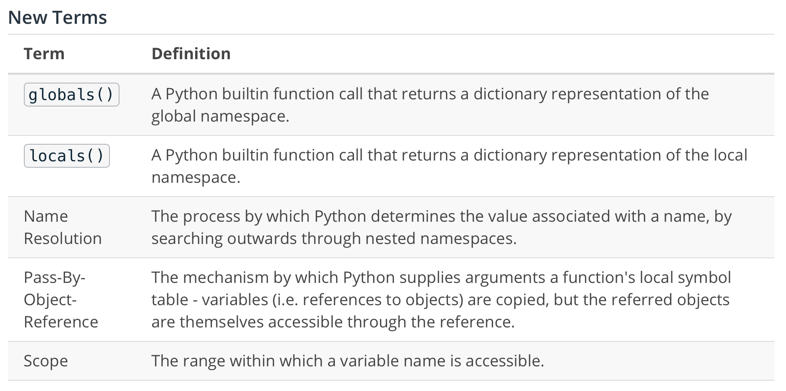

# Functional programming

## Functions

Recall that the `def` keyword is used to define a new function:

```python
def fn_name(param1, param2):
    value = do_something()
    return value
```

### Scope




#### Name Resolution

As mentioned before, name resolution searches outwards for a matching entry in nested symbol tables. Name resolution follows LEGB order:

* First, check the local symbol table;
* Next, check any enclosing symbol tables from enclosing functions;
* Then, look in the global (top-level) symbol table;
* Finally, check the built-in symbol table (print, input, etc.)


### Function Parameters

#### Keyword Arguments


***Example***

```python
def parrot(voltage, state='a stiff', action='voom', type='Norwegian Blue'):
    print("-- This parrot wouldn't", action, end=' ')
    print("if you put", voltage, "volts through it.")
    print("-- Lovely plumage, the", type)
    print("-- It's", state, "!")
```

This function has one required (positional) argument and three optional (keyword) arguments.


#### Variadic Arguments

A ***variadic parameter collection*** collects excess arguments (that would otherwise go unmatched to a parameter) into a data structure, for the function implementation's use. We'll see two kinds of variadic parameters: ***variadic positional parameters*** and ***variadic keyword parameters***.

A parameter of the form `*name` (such as`*args`) in a function signature introduces a ***variadic positional parameter***. This parameter will capture excess positionally-supplied arguments into a tuple named the same thing, such as args.

The `print` function in Python takes in a variable number of arguments. It's signature is (something like)


```python
def print(*objects, sep=' ', end='\n', file=sys.stdout, flush=False):
```
In the above signature, the `*objects` is the variadic positional parameter. The other parameters are keyword parameters. 

To get a feel for variadic positional parameters, consider the following function and its various invocations:

```python
def print_my_arguments(a, *b, c=1):
    print(f"a={a}, b={b}, c={c}")

print_my_arguments(2)                   # a=2, b=(), c=1
print_my_arguments(2, 7)                # a=2, b=(7,), c=1
print_my_arguments(2, 7, 1)             # a=2, b=(7, 1), c=1
print_my_arguments(2, 7, 1, 8)          # a=2, b=(7, 1, 8), c=1
print_my_arguments(2, 7, 1, 8, 2)       # a=2, b=(7, 1, 8, 2), c=1
print_my_arguments(2, 7, 1, 8, 2, c=8)  # a=2, b=(7, 1, 8, 2), c=8
```


***Variadic Keyword Parameters***

A parameter of the form `**name` (such as`**kwargs`) in a function signature introduces a variadic keyword parameter. This parameter will capture excess keyword-supplied arguments into a dictionary named the same thing, such as `kwargs`.

Variadic keyword parameters are a bit less common, but still appear throughout Python. For example, the `str.format` method has the following signature:

Not only does this method have a variadic keyword parameter (`**kwargs`), it also has a variadic position parameter (`*args`)! This means that this method can receive any number of positionally-supplied arguments and any number of keyword-supplied arguments.

```python
def print_my_arguments(a, b=1, **c):
    print(f"a={a}, b={b}, c={c}")

print_my_arguments(2)                      # a=2, b=1, c={}
print_my_arguments(2, x=7)                 # a=2, b=1, c={'x': 7}
print_my_arguments(2, x=7, y=1)            # a=2, b=1, c={'x': 7, 'y': 1}
print_my_arguments(2, x=7, y=1, z=8)       # a=2, b=1, c={'x': 7, 'y': 1, 'z': 8}
print_my_arguments(2, x=7, y=1, z=8, b=2)  # a=2, b=2, c={'x': 7, 'y': 1, 'z': 8}
print_my_arguments(2, x=7, b=2, y=1, z=8)  # a=2, b=2, c={'x': 7, 'y': 1, 'z': 8}
```


## First class function

Let's take a look at an example.

```python
def echo(arg):
    """Return the first argument."""
    return arg

print(echo.__name__)  # => echo
print(echo.__doc__)  # => Return the first argument.
print(echo.__code__)  # => <code object echo at 0x..., file "...", line X>
```


### Second-order function  
A built-in function that filters an iterable by keeping only elements that successfully pass a predicate function.  
`filter(predicate_function, iterable)`  
A built-in function that applies a function to every element of an iterable.  
`map(fn, iter)`

### Lambda Functions

An anonymous function used to define simple callables.

`lambda params: expr(params)`

### Iterators and Generators

***Iterators***  
An `iterator` represents a (finite or infinite) stream of data.

The `next(iter)` call asks an `iterator` to yield a successive value. If there are no more values, it raises `StopIteration`. The `iter(data)` function produces an iterator from an iterable data source.

#### Example

```python
# Build an iterator over [1,2,3]
it = iter([1,2,3])
next(it)  # => 1
next(it)  # => 2
next(it)  # => 3
next(it)  # raises StopIteration error
```

Iterators maintain some semblance of state:

```python
it = iter(range(100))
66 in it
next(it)  # => 67
```

Some built-in functions even produce iterables:

```python
range(stop)
enumerate(iterable)
zip(*iterables)
map(fn, iterable)
filter(pred, iterable)
```

### Generator Expressions

Generator expressions are a useful feature for describing a stream of data inline. They behave a bit like a "lazy list comprehension."

```python
gen = (costly_fn(data) for data in iterable)
print(gen)  # <generator object <genexpr> at 0x109055cf0>
next(gen)  # => The first transformed element.
next(gen)  # => The second transformed element.

```

#### Generator Functions

A generator function looks like a normal function, except it contains the keyword `yield`.

```python
def generate_ints(n):
    for i in range(n):
        yield i

g = generate_ints(3)  # Doesn't start the function! Just sets up the iterator
type(g)  # => <class 'generator'>

next(g)  # => 0. Run until the next yield statement.
next(g)  # => 1. Run until the next yield statement.
next(g)  # => 2. Run until the next yield statement.
next(g)  # raises StopIteration. Finished the function before finding another yield statement.
```

### Decorators

***Decorator Syntax***

```python
@print_args
def compute(x, y, z=1):
    return (x + y) * z
```

This new syntax (`@decorator`) applies a decorator to whatever's defined immediately below it. In this case, the `compute` function will be defined as normal, and then immediately passed through the `print_args` decorator. In this way, we only need to toggle one line of code (`@print_args`) to decorate our function with this new functionality. What's more, we can use this `print_args` decorator on any function we'd like! We wrote one decorator, and we get to use it everywhere.

***memoize decorator***

`@memoize`

```python
import functools

def memoize(function):
    function._cache = {}
    @functools.wraps(function)
    def wrapper(*args, **kwargs):
        key = (args, tuple(kwargs.items()))
        if key not in function._cache:
            function._cache[key] = function(*args, **kwargs)
        return function._cache[key]
    return wrapper
```

Python 3.8 introduced a new, funky syntax to identify that some parameters can only be positionally-supplied: `def f(a, b, /, c): pass`. This function can be called as `f(1, 2, 3)` or `f(1, 2, c=3)`, but not `f(1, b=2, c=3)`.