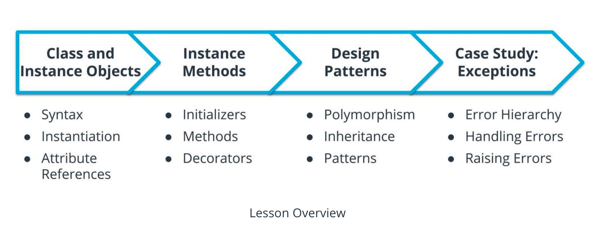
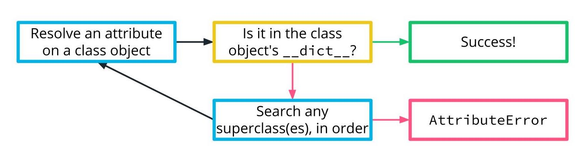
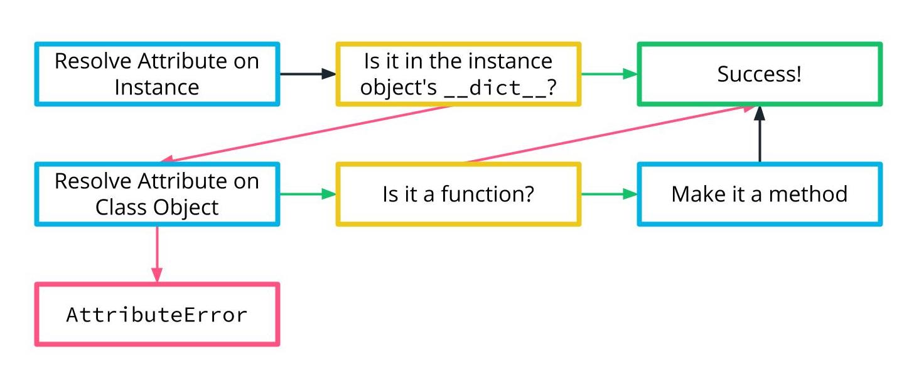
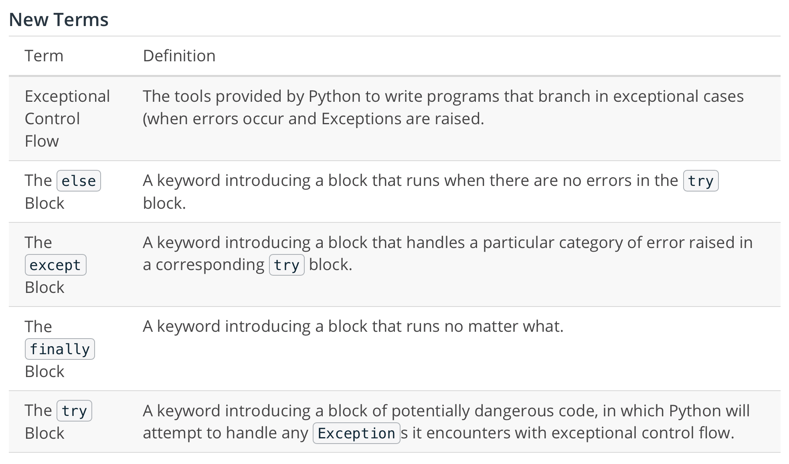
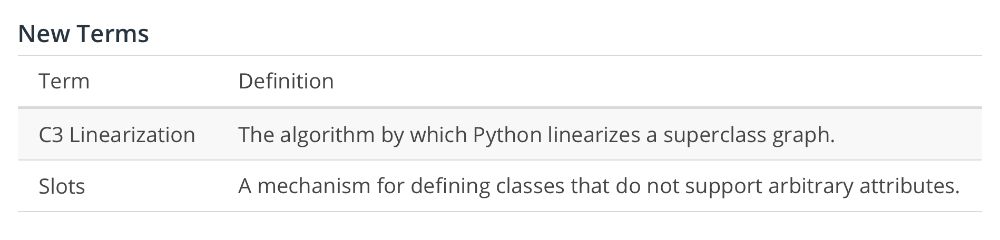

# Object-Oriented Programming

In this lesson, we'll:

* define class objects, instantiate them into instance objects, and assign and resolve attributes on both
* write initializers and normal methods, and use method decorators to change the method invocation syntax and behavior
* use magic methods to make our custom classes act like other types, and use inheritance to nest object relationships
* explore Python's Exception hierarchy, and tools for exceptional control flow, as a case study in object-based design thinking



***Learning Objectives***

By the end of this lesson, you will be able to:

* Design Python programs leveraging custom classes
* Instantiate custom classes into instances, and resolve attributes on both
* Describe common object-based patterns, while avoiding traps
* Utilize exceptional control flow to appropriately handle errors

## Define a Class Object

```python
class ClassName:
    <statement>
    <statement>
    ...
    <statement>
```

Let's give an example.

```python
class MyFirstClass:
    """A simple example class."""
    num = 12345
    def greet(self):
        return "Hello, world"
```

Our class object also has *attributes* (the ones we defined in its body!) that we can access with a new-ish syntax - asking Python for `some_object.some_attribute` instructs the name `some_attribute` to be resolved on the `some_object` object. 

As an interesting implementation note, these attributes are stored in a special attribute `__dict__` which store a mapping type that associates attribute names to their values. In some sense, it's like we have a "namespace" attached to this class object!

```python
print(type(MyFirstClass.__dict__))  # something that acts a lot like a normal dictionary
print('num' in MyFirstClass.__dict__)  # True
print('greet' in MyFirstClass.__dict__)  # True
```

## Instantiating Class Objects

We can define class objects and resolve attributes on them. How do we make instances of a class? Through instantiation! The syntax `ClassName(...)` constructs a new instance object whose type is the class object `ClassName`.

```python
class House:
    layout = 'square'
    def paint(self, color):
        self.color = color

# As before, we can access attributes.
print(House.layout)  # 'square'
print(House.paint)  # <function House.paint(self, color)>

# This is the new syntax! Instantiate a class object to get back an instance object.
home = House()  # `home` is now a _specific_ instance object of type `House`
print(home)  # <House at 0x....>
print(type(home) is House)  # True
```

***Special Functions***

Python offers the special functions `getattr`, `setattr`, and `delattr` to perform these operations, if you would like to think of them functionally.

Specifically:

* `getattr(x, 'y')` is equivalent to `x.y`. It also accepts a default fallback value if the attribute isn't found.
* `setattr(x, 'y', z)` is equivalent to `x.y = z`
* `delattr(x, 'y')` is equivalent to `del x.y`

## Initialization

`__init__` Python will call it during the initialization of a newly-instantianted instance object.

```python
class House:
    def __init__(self, size, color='white'):
        self.size = size
        self.color = color

home = House(1000, color='red')
print(home.size)  # 1000
print(home.color)  # red

mansion = House(25000)
print(mansion.size)  # 25000
print(mansion.color)  # white
```

## Methods and Functions

Methods and functions aren't precisely the same - a method is a bundle that contains a referenced function and a bound instance object.

***Definition--Method***

A callable object that bundles a callable function with an instance object, which upon invocation calls the bundled function with the bundled object as the first argument.

### Example

```python
class House:
    layout = 'square'
    def __init__(self, size, color='white'):
        self.size = size
        self.color = color
    def paint(self, color):
        self.color = color

# We can instantiate a `home` from the class object `House`
# (using our `__init__` method!) and resolve attributes.
home = House(1000)
print(home.size)  # 1000
print(home.color)  # white

# We can resolve attributes on the class object too.
print(House.layout)  # square
print(House.paint)  # <function House.paint(self, color)>
```
Everything is looking good so far. What if we want to paint our home, or ask for our home's layout? Specifically, what happens if we look at the class object attributes from the lens of the instance object?
```
print(home.layout)  # square - everything looks normal
print(home.paint)  # <bound method House.paint of <House object at 0x...>> - what's this?!
```
The attribute resolution, upon failing to find a match in `home.__dict__`, fell back to searching through `House.__dict__`. For home.layout, everything is normal. For home.paint, something strange happened! We received a method, not a function. Time to investigate.
```python
# The method contains information about the referenced function and the bound instance object.
print(home.paint.__func__)  # <function House.paint(self, color)>
print(home.paint.__self__)  # <House at 0x...>
print(home.paint.__self__ is home)  # True
```
Invoking the method invokes the referenced function, inserting the bound object as the first argument
```python
home.paint('red')
# is equivalent to
House.paint(home, 'red')

# The home's color is indeed changed after painting the home.
print(home.color)  # red
```

### Shared Information

Attribute resolution can be a touchy subject - we've seen that class objects and instances objects can have attributes (stored in a special `__dict__`
attribute)

When an attribute is looked up on an instance object and isn't found, Python falls back to the resolving the attribute on the class object of that instance object.






[link](https://www.digitalocean.com/community/tutorials/understanding-class-and-instance-variables-in-python-3)

## Decorating Methods to Adapt Call Semantics

A built-in decorator that upgrades a method into a gettable (and perhaps settable) property.

### Getters

The `@property` decorator, applied to a method, changes the method call behavior so that the method itself can be accessed as if it were an attribute.

Uses:

* Provide what appears to be an "access-only" attribute
* Provide "attributes" whose value is dynamically determined from other attributes
* Provide "attributes" that perform more complex behavior, like lookup information or cache complex values.

### Setters

Once a method `name` is decorated with `@property`, the `@name.setter` decorator can decorate a method to assign a new value to a property (there's also an `@name.deleter` to "delete" the property, but we'll skip that)

Uses:

* Update many data attributes after one is set.
* Hide more complex assignments behind the guise of an assignment.

Remember, attributes in Python can already be accessed and mutated. You only need to use properties when you're doing something unusual with your attributes.

As always, when changing Python's default behavior by using method decorators, it's important to document your changes so that clients can understand what's different.

```python
class Distance:
    _KILOMETERS_PER_MILE = 1.60934
    def __init__(self, km):
        self.km = km
    @property
    def miles(self):
        return self.km / self._KILOMETERS_PER_MILE
    @miles.setter
    def miles(self, miles):
        self.km = miles * self._KILOMETERS_PER_MILE
```

### Class and Static Methods

There are two other intriguing method decorators built into Python: `classmethod` and `staticmethod`

The `@classmethod` decorator changes method call behavior by passing the class object, not the instance object, as the first argument.

The `@staticmethod` decorator changes method call behavior by not supplying either the instance object nor the class object as the first argument.

Class methods are a useful technique for representing factory functions - other ways to create instance objects, but attached to the class itself.

Static methods are a useful technique for attaching utility functions to a class.

In both of these circumstances, the same or similar behavior can be achieved with a standalone function - so whether your functionality is a normal function or a decorated method depends on how much that functionality "belongs" to the class itself.

***Nothing Is Private!***

When it comes to Python, it's nearly impossible to hide.

If you want an attribute to seem "secret," you can prefix it with an underscore to indicate to other programmers that it's not part of the public interface. Often, in this case it's nice to include a managed getter (e.g. an `@property`) or even setter to handle access or assignment to the attribute. In extreme cases, you can use two underscores to begin (but not end) an attribute name to invoke Python's name mangling, which makes it harder (but not impossible) to access the attribute.

To reiterate, these are conventions. In Python, almost nothing is truly private. With great power comes great responsibility.

### Magic Methods

`obj.__len__` -> len()

`obj.__str__` -> print()

`obj.__add__(other)` -> obj + other

`__contains__`-> in

##Single and Multiple Inheritance

Classes in Python can derive (inherit) from other classes.

```python
class DerivedClassName(BaseClassName):
    pass

class MultiplyDerived(Base1, Base2, Base3):
    pass
```

`self.__class__.__name__` which gives the name of the class object of the supplied instance object.

Python promotes object-based design, not strict object-oriented programming. Essentially, use object-oriented programming when you need it, but don't be trapped by object-oriented thinking. Python's dynamic typing system ad high-level reflective tools make it a much more flexible, expressive programming language.

Some OOP patterns have hard-to-identify support within the language, so here we call out a few examples:

* Singleton? Use the fact that Python only ever imports a module once
* Factory? Use a standalone function or a class (or even perhaps static) method.

If the interface is becoming too cumbersome, embrace the principles of duck-typing. If it looks like a duck and quacks like a duck, then to Python, it's as good as a duck.

If inheritance relationship become too cumbersome, embrace the principles of composition. Not everything needs to be defined as a custom class.

## Handling Errors and Exceptions

* ***Syntax Errors*** are "errors before execution", when the text of a Python program is not syntactically valid. The line `print "Hello"` is missing parentheses around the `print` function.
* ***Exceptions*** are "errors during execution," when Python encounters some error while executing the code. The line `print(spam)` might fail if the name `spam` cannot be resolved.

When Python encounters an unhandled failure, it halts the program and prints a stack trace, with helpful debugging information that tells you on what line and token the error occurred, the function calls that brought Python to that point, and the type of error and message.

* ***Exception Hierarchy***The class hierarchy of built-in exceptions inheriting directly or indirectly from `BaseException`.

`type.mro()` A method to ask a type for its "method resolution order" - effectively, a linearization of its superclass graph.

### Handling Errors in Python

The `try` and `except` blocks are fundamental to handling errors. The optional `else` and `finally` blocks are more supplemental, and more rarely seen.

```python
try:
    dangerous_code()
except SomeError:
    handle_the_error()
else: 
    handle_no_error()
finally:
    do_no_matter_what()
```



### Raising Errors (Signaling Exceptional Circumstances)

`raise` A keyword to raise an Exception subclass or an instance of an Exception subclass.

```python
# Raise an instance of a BaseException subclass
>>> raise NameError("Why hello!")
# Traceback (most recent call last):
#   File "<stdin>", line 1, in <module>
# NameError: Why hello!

# Raise a subclass of BaseException
>>> raise NameError
# Traceback (most recent call last):
#   File "<stdin>", line 1, in <module>
# NameError
```

To define a custom type of error, subclass (directly or indirectly) from a built-in exception.

```python
class MyCustomNameError(NameError):
    pass

# Now MyCustomNameError is a part of the hierarchy!
print(MyCustomNameError.mro())
[MyCustomNameError, NameError, Exception, BaseException, object]

# Custom errors can be raised from this class
raise MyCustomNameError("My custom error")
# Traceback (most recent call last):
#   File "<stdin>", line 1, in <module>
# MyCustomNameError: My custom error
```

### Edge case


If `__slots__` is defined, its elements are the only acceptable attribute names, and the class object has no `__dict__` attribute. 



```python
class A: pass
class B: pass
class C: pass
class D: pass
class E: pass
class K1(A, B, C): pass
class K2(D, B, E): pass
class K3(D, A): pass
class Z(K1, K2, K3): pass

# Print the C3 linearization of Z's superclasses, accessible by the `type.mro` function, which stands for Method Resolution Order.
print(Z.mro())  # [Z, K1, K2, K3, D, A, B, C, E, object]
```

```python
class NotSlottedExample:
    def __init__(self, name, uid):
        self.name = name
        self.uid = uid


class SlottedExample:
    __slots__ = ['name', 'uid']
    def __init__(self, name, uid):
        self.name = name
        self.uid = uid


a = NotSlottedExample('Seb', 1)
b = SlottedExample('Seb', 1)

print(a.name, a.uid)  # ('Seb', 1)
print(b.name, b.uid)  # ('Seb', 1)

print(a.__dict__)  # {'name': 'Seb', 'uid': 1}
print(b.__dict__)
# AttributeError: 'SlottedExample' object has no attribute '__dict__'

a.founder = True  # Okay, no errors here!
b.founder = True
# AttributeError: 'SlottedExample' object has no attribute 'founder'
```

### Final exercise: Online Shopping Service

product.py
```python
class Product:
    def __init__(self, name, description, price, seller, available=True):
        self.name = name
        self.description = description
        self.price = price
        self.seller = seller
        self.available = True
        self.reviews = []
```

review.py
```python
class Review:
    def __init__(self, content, user, product):
        self.content = content
        self.user = user
        self.product = product

    def __str__(self):
        return f"Review of {self.product} by {self.user}: '{self.content}'"
```

user.py
```python
from product import Product
from review import Review


class User:
    def __init__(self, id, name):
        self.id = id
        self.name = name
        self.reviews = []

    def write_review(self, content, product):
        review = Review(content, self, product)
        self.reviews.append(review)
        product.reviews.append(review)

    def sell_product(self, name, description, price):
        product = Product(name, description, price, self, available=True)
        print(f"{product} is on the market!")
        return product

    def buy_product(self, product):
        if product.available:
            print(f"{self} is buying {product}.")
            product.available = False
        else:
            print(f"{product} is no longer available.")

    def __str__(self):
        return f"User(id={self.id}, name={self.name})"
```

product.py
```python
class Product:
    def __init__(self, name, description, seller, price, availability):
        self.name = name
        self.description = description
        self.seller = seller
        self.reviews = []
        self.price = price
        self.availability = availability

    def __str__(self):
        return f"Product({self.name}, {self.description}) at ${self.price}"
```


